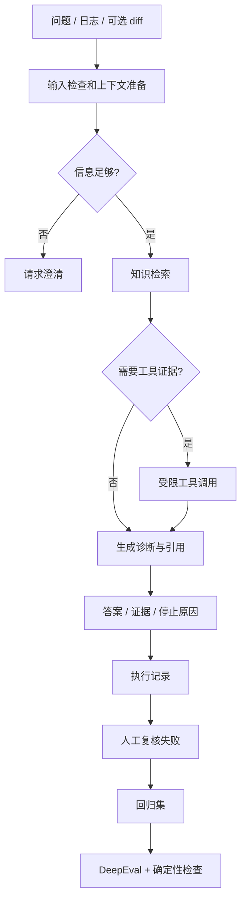

# 项目范围与设计草案

以下是待实现的约定，不代表现有功能。按每周任务调整，并用决策记录保存原因。

## 最小范围

用户：你自己。知识：一个项目的资料与历史问题。任务：诊断与排查建议。
v0.1 不包含自动部署、自动修复生产代码、大规模爬取、多 Agent 平台和复杂前端。
先做可调用的 Python 接口；CLI/API 与 UI 在核心功能可验证后增加。

## 目标流程

图表示后期目标；第 3 周先实现 B→E→H 的普通 RAG 基线。

## 接口约定

未来提供 `diagnose(request) -> result`。评测层直接调用该接口，不通过聊天网页抓取答案。

输入字段：
- `case_id`：评测时的用例 ID，日常调用可为空。
- `session_id`：会话隔离标识。
- `project_id`、`project_version`：目标项目与代码版本。
- `question`：问题文本。
- `attachments`：显式选择的本地资料引用，不能默认扫描整个项目树。

输出字段：
- `status`：answered / needs_clarification / insufficient_evidence / tool_error / budget_exceeded。
- `answer`：事实、假设、建议、尚未验证内容。
- `evidence`：source_id、chunk_id、版本、位置、实际引用文本。
- `tool_calls`：工具名、输入、执行状态、输出摘要、耗时。
- `stop_reason`：停止原因。
- `usage`：模型调用数、工具调用数、token、耗时；未知成本为 null，不能填 0。

评测输入中的期望答案、期望工具和评分标准不能传给被测 Agent。

## 实现模块与时间

| 模块 | 职责 | 开始时间 |
|---|---|---|
| knowledge | 资料读取、清洗、切分、来源追踪 | 第 2 周 |
| retrieval | 索引、检索、父块回取 | 第 3 周 |
| agent | 状态、图、停止条件、结果结构 | 第 4 周 |
| tools | 只读报告/diff 工具，之后再做受限执行 | 第 6 周 |
| observability | 记录真实执行结果与版本 | 第 3 周逐步增加 |
| evals | 用例加载、适配、评分、报告 | 第 5 周 |

不必提前建所有抽象层，先为当前一个用例实现最小接口。

## 设计决策要写清

1. 为什么用该 embedding、分块与检索策略？
2. 为什么需要 Agent 路由，而不是固定工作流？
3. 工具调用上限是多少，依据是什么？
4. 会话历史是否持久化，如何隔离？
5. 失败后如何知道是模型、检索、工具还是配置问题？

每个决定都用 [决策模板](templates/decision.md) 保存；没有实验支持的选择标为“待验证假设”。
